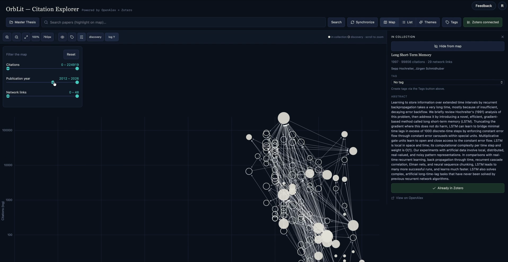
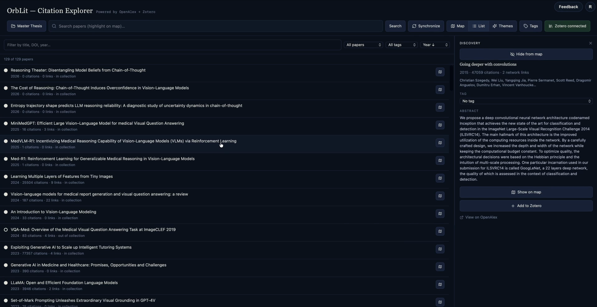

# OrbLit — Citation Explorer

OrbLit is a free, open-source tool for literature discovery: search
[OpenAlex](https://openalex.org) for papers, visualize citation networks, and
sync with your [Zotero](https://www.zotero.org) library. It grew out of
RefMap, a local-only citation map, and is rebuilt on Next.js with accounts
and encrypted per-user Zotero credentials.

Licensed under the [MIT License](LICENSE).

**Live at:** [orblit.io](https://orblit.io)

**Source:** [github.com/Acul01/OrbLit](https://github.com/Acul01/OrbLit)

## Screenshots

### Map view



### List view



## Stack

- **Next.js 16** (App Router) on **Vercel**
- **Supabase**: Postgres (`profiles`, `projects`, `zotero_credentials`,
  all RLS-protected) + Auth
- **next-intl**: English (default, unprefixed) and German (`/de/...`)
- Zotero API calls are proxied server-side (`app/api/zotero/*`) — the
  user's API key is encrypted (AES-256-GCM) and never reaches the browser

## Local development

```bash
git clone https://github.com/Acul01/OrbLit
cd OrbLit
npm install
cp .env.example .env.local
```

Fill in `.env.local` — you'll need a Supabase project (URL, anon key,
service-role key) and a generated `ZOTERO_ENCRYPTION_KEY`
(`openssl rand -base64 32`). Apply the database schema:

```bash
supabase link --project-ref <your-project-ref>
supabase db push
```

```bash
npm run dev
```

Opens `http://localhost:3000`.

## Usage

- **Sign up** → the tool at `/app` is free, with no plan limits
- **Zotero**: connect once (User ID + API key, from
  [zotero.org/settings/keys](https://www.zotero.org/settings/keys)) — the
  key is stored encrypted server-side, not re-entered per session
- **Search**: enter a title/keyword → click a result to highlight it on the
  current map (others dim)
- **Click** a node: details in the sidebar. **Double-click**: expand the
  network around that node. **Drag**: freely reposition nodes
- **Monitor**: check again for new citing articles
- **Zotero collection**: pick a collection (or main library) from the
  toolbar dropdown — used for DOI sync and new papers
- **Create Map**: builds a scatter map of the selected collection
  (X = publication year, Y = total citations). **Filled** nodes are papers
  in the collection; **outlined** nodes are discovery papers outside it
  that cite or are cited by the collection. Custom **tags** (name + color)
  can be assigned to papers. Node size reflects network degree
- **Map / List**: switch between the scatter map and a filterable list
- **Add to Zotero**: creates the paper (title, authors, DOI, abstract) as a
  `journalArticle` in the selected collection
- **Export/Import JSON**: your map (nodes, links, tags, view state)
  autosaves to your account, but can also be exported/imported as a JSON
  file for offline backup

## Production build

```bash
npm run build
npm run start
```

## Notes

- Your map, tags, and Zotero DOI cache autosave to Supabase
  (`projects` table) — no local storage dependency
- OpenAlex calls happen client-side (public API, no auth needed); Zotero
  calls happen server-side only
- See `supabase/migrations/` for the full schema and RLS policies
